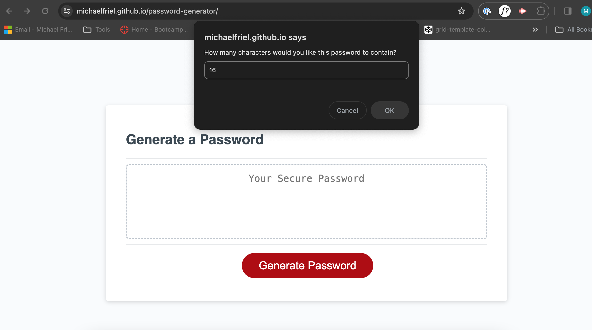
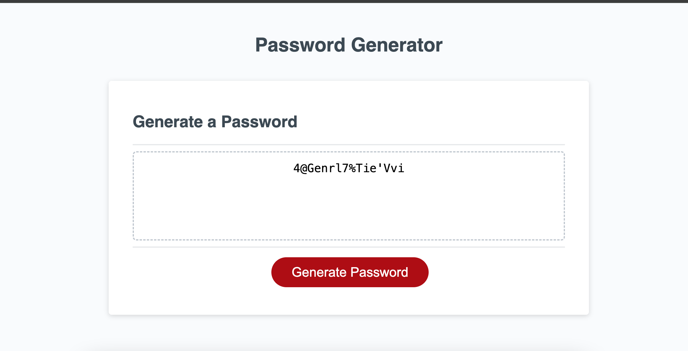
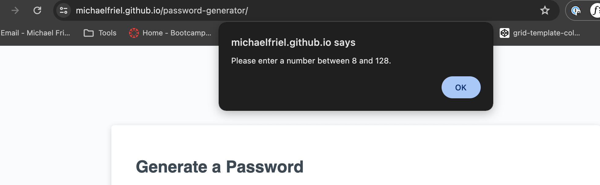
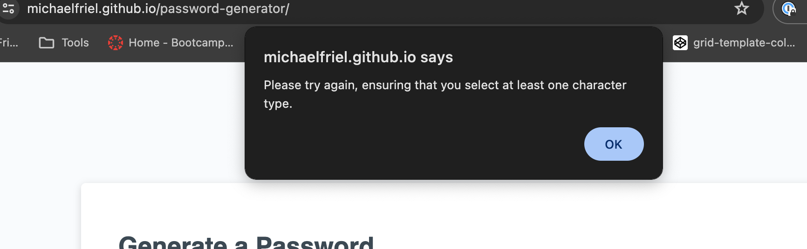

# Password Generator

## Description
This webpage is intended to be used as a password generator, with a series of simple questions answered by the user to determine the structure of the outputted password. 
Once the user clicks the Generate Password CTA, they will be prompted to provide a character limit and decide which character types should be included. Once provided, a random password will be displayed within the Text Area field.

**The following processes are used in order to create this functionality:**
* Basic HTML file which contains a text area and button.
* Javascript file which contains a variety of functions:
  * All possible characters contained within arrays.
  * Password Options showcased to user as prompts and returned as an object.
  * Characters variable created as an array which uses the concat method to compile a character pool from which to select password from.
  * New Password created by randomly selecting characters from Characters variable until limit is reached.
  * Password written to text area via document object.
* The password must be between 8 and 128 characters long. If not, the user is asked to reinput the number.
* The password must contain at least one character type. If not, the user must begin the process again.

## Installation
To review the portfolio, please follow this URL: https://michaelfriel.github.io/password-generator/

The code is available to be cloned from the Bootstrap-Portfolio repository, using gut commands. To access this, please follow this URL: https://github.com/MichaelFriel/password-generator

## Usage
This application is fairly intuitive, with step by step usage guide as follows:

1. Click 'Generate Password' CTA to initialise the prompts.
2. Input desired number of characters. If this is not between 8 and 128, additional alert will ask that you re-input your figure.
3. Choose what character types you would like to be included. In this context, 'cancel' means 'do not include'. If you have not chosen any character types, an alert will inform you that you need to begin the process again and include at least one.
4. Your password will be displayed in the text area.

## License
Please see Mit License contained within repository.